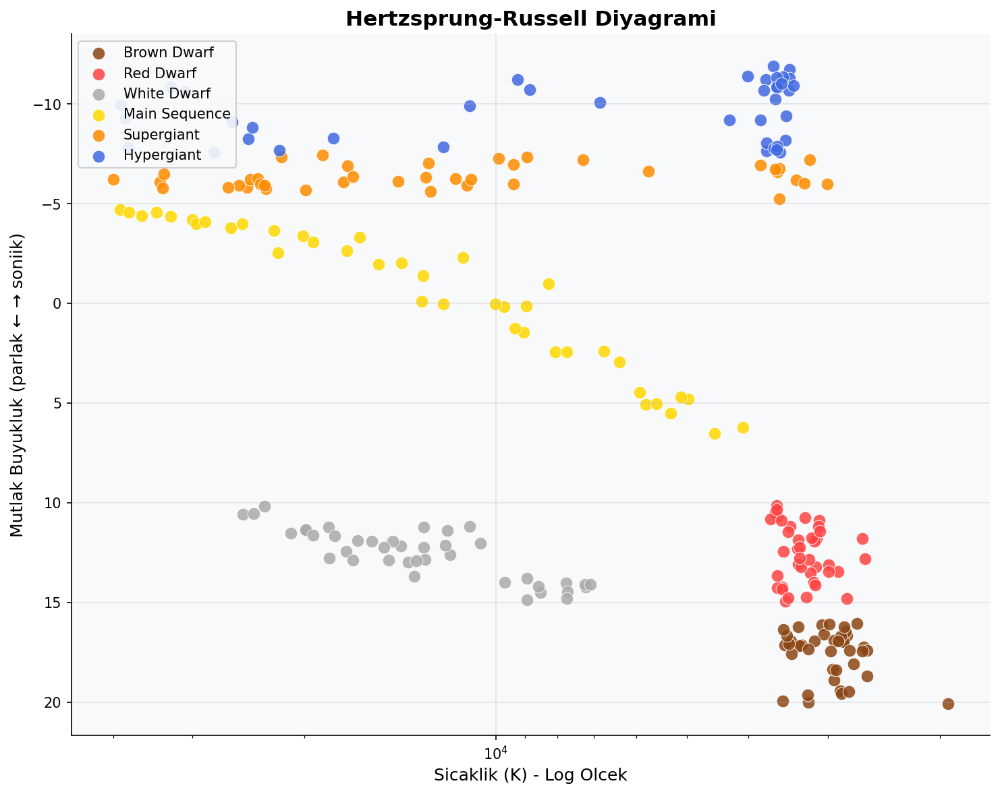
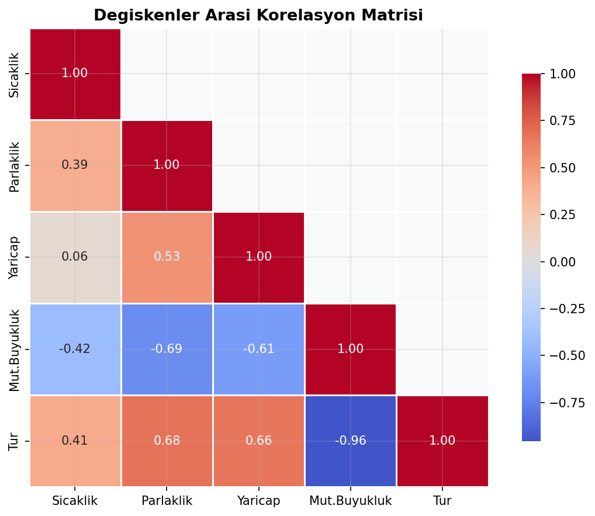
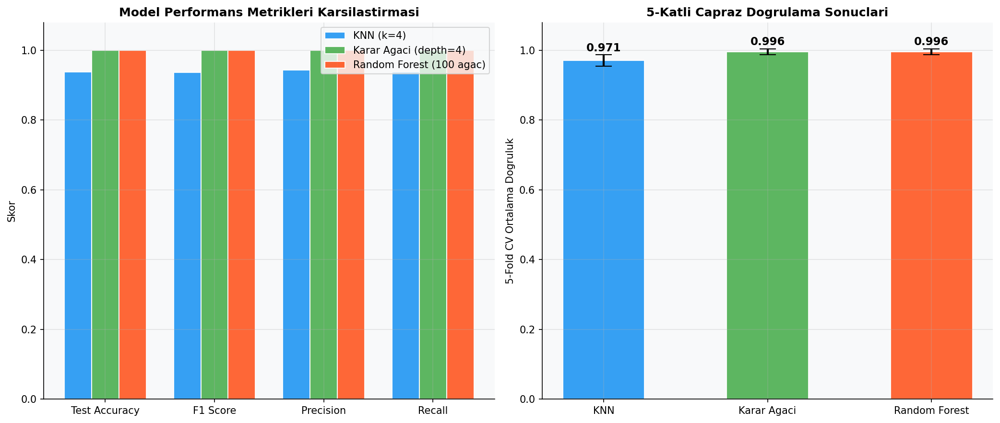
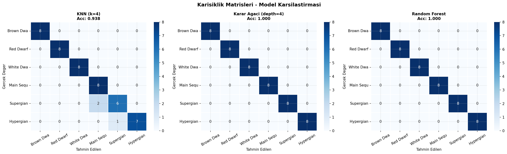

# Star Type Classification

An end-to-end Machine Learning and Data Mining project that classifies stars into 6 distinct physical categories using characteristics like temperature, luminosity, radius, and absolute magnitude. The project implements K-Nearest Neighbors (KNN), Decision Trees, and Random Forest Classifiers using Scikit-Learn pipelines, cross-validation, and performance evaluation curves.

---

## 📊 Dataset Characteristics

The model is trained on the `Stars.csv` dataset, which consists of 240 samples. The features used for prediction include:

* **Temperature (K)**: Star surface temperature (Kelvin).
* **Luminosity (L/Lo)**: Relative luminosity compared to the Sun.
* **Radius (R/Ro)**: Relative radius compared to the Sun.
* **Absolute Magnitude (Mv)**: Visual absolute magnitude of the star.
* **Star Color**: Categorical color of the star (Red, Blue, White, Yellow, etc.).
* **Spectral Class**: O, B, A, F, G, K, M spectral classification.

---

## 🎯 Target Star Classes

The model classifies stars into one of the following 6 types:

* **0**: Red Dwarf (Kızıl Cüce)
* **1**: Brown Dwarf (Kahverengi Cüce)
* **2**: White Dwarf (Beyaz Cüce)
* **3**: Main Sequence (Anakol Yıldızı)
* **4**: Supergiant (Dev Yıldız)
* **5**: Hypergiant (Üstdev / Hiperdev Yıldız)

---

## 🧠 Algorithms & Methodology

* **Data Preprocessing**: Handles encoding of categorical attributes (Color, Spectral Class) and normalizes numeric values using `StandardScaler`.
* **Model Pipeline**: Implements clean training pipelines with three classifiers:
  * **K-Nearest Neighbors (KNN)**
  * **Decision Tree Classifier**
  * **Random Forest Classifier**
* **Model Evaluation**: Leverages Stratified K-Fold Cross-Validation, learning curves, classification reports, and confusion matrices to compare model performance.

---

## 📊 Sample Visualizations

Below are sample analytical charts generated during the data mining process (saved in the `Outputs/` directory):

### Hertzsprung-Russell (HR) Diagram of Classified Stars
Astronomical chart plotting star luminosity versus surface temperature, highlighting the distinct physical clusters of star types:


### Feature Correlation Matrix
Heatmap showing the linear relationships between physical star attributes:


### Machine Learning Model Comparison
Comparison of Accuracy, Precision, Recall, and F1-Score across KNN, Decision Tree, and Random Forest models:


### Classifier Confusion Matrices


---

## 📁 Repository Structure

```
star-type-classification/
├── .ipynb_checkpoints/
├── Outputs/                                 ← Model performance outputs & learning curves
├── Stars.csv                                ← Raw star dataset
├── Veri_Madenciligi_Proje.ipynb             ← Complete Jupyter Notebook (data analysis & modeling)
├── LICENSE                                  ← MIT License
├── .gitignore                               ← Git ignore file
└── README.md                                ← Project documentation (This file)
```

---

## 📦 Requirements & Dependencies

The project requires Python 3.8+ and the following libraries:

* **pandas** >= 1.4.0
* **numpy** >= 1.22.0
* **matplotlib** >= 3.5.0
* **seaborn** >= 0.11.0
* **scikit-learn** >= 1.0.0

---

## ⚙️ Quick Start

### Prerequisites
* Jupyter Notebook or JupyterLab installed.

### Installation
1. Clone or download this repository.
2. Open a terminal and navigate to the project directory:
   ```bash
   cd star-type-classification
   ```
3. Run Jupyter Notebook:
   ```bash
   jupyter notebook
   ```
4. Open and run `Veri_Madenciligi_Proje.ipynb` to execute the data mining and model training cells.

---

## 📄 License

Distributed under the MIT License. See `LICENSE` for more information.
